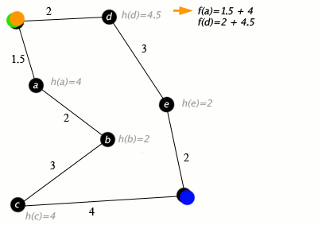

<h3>Resumo</h3>

O algoritmo de A*  ́e descendente dos algoritmos de Dijkstra e Breadth First Search, ele utiliza de uma função
chamada de heuristica que calcula a rota entre dois ou mais nós em um plano. Ao utilizar a heuristica o A*
determina qual o melhor caminho baseado na menor distância entre o nó de origem, os nós de transição e
o nó de destino.

