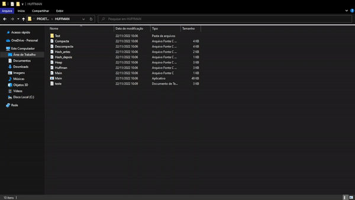
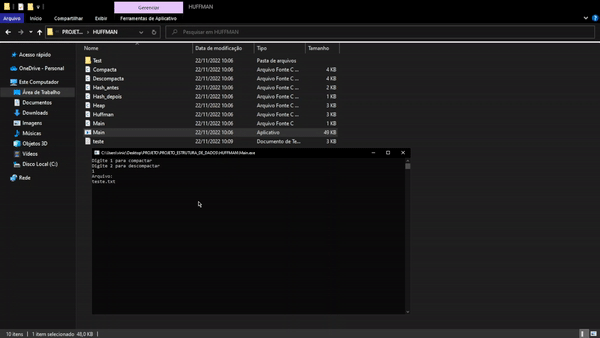

<h2>Resumo</h2>
<h3>Compressão</h3>

 Inicializa uma hash table e cria um arquivo “.huff” onde será armazenado os dados comprimidos. Em seguida lê os bytes do arquivo de entrada até o final (função feof( ) )  e inseri na hash table utilizando a função Inserir( ). Nessa função, para a variável de chave (key) será atribuído o valor de modulo do byte de entrada com o tamanho máximo do hash (constante de valor 257). 

 Em seguida, inicializa a heap onde serão organizadas as frequências de bytes do arquivo e os nós da arvore de huffman. Apos isto, são inseridos os dados na arvore e cada nó será organizado na heap baseado na menor frequência, na função enqueue( ) a fila será organizada de forma que os nós com a menor frequência fiquem nas primeiras posições da heap.

 A partir da heap criada anteriormente a função createHTfromHEAP( ) cria uma árvore de huffman a partir dessa heap utilizando os nós de menor frequência e formando em um novo nó que é o pai desses dois e repete esse processo até que a heap acaba (o tamanho é menor que 1) e a árvore é formada. 

 Depois que a árvore é criada precisamos organizá-la no arquivo para isto será utilizada a função printHTinFile( ) . Em seguida precisamos inicializar uma nova hash table para armazenar os novos valores de bytes utilizando a função set( ) podemos definir um novo valor para o byte e coloca-lo na hash com a função another_put( ) 

 Com a tabela Hash criada anteriormente, agora há a necessidade de ajustar os bits para que encaixe no byte de maneira que o arquivo fique comprimido, para isto é necessário pegar do primeiro bit até o último e então orientar os bits de maneira que fiquem organizados em um byte composto por 7 bits dos novos valores: ex. A = 11000000, B = 00000001, C = 00000100 quando bits_not_shifted chegar a zero o final_byte que será colocado no arquivo é A+B+C = 11000101.

 Com a árvore já criada e comprimida agora falta adicionar o lixo e o cabeçalho no arquivo. Para adicionar o lixo basta colocar o final_byte incompleto dentro do arquivo já que quando há a compressão dos bytes de dados devem sobrar bits que não foram utilizados. Já para o cabeçalho identificamos o tamanho da árvore com a função Tree_size() e criamos o cabeçalho com o tamanho do lixo (3 bits) + tamanho da árvore (13 bits) criando dois bytes para o cabeçalho ( 3 bits de lixo + 5 de tamanho e 8 de tamanho) 

<h3>Descompressão</h3>

 Em primeiro lugar, é necessário extrair o tamanho do lixo e o tamanho da árvore do arquivo a ser descomprimido, para isso são utilizadas as funções Trash_Size() e Tree_Size(). Em seguida, com a função Extract() a árvore de huffman dentro do arquivo é retirada seguindo a ideia de que o simbolo " * " representa uma soma de bytes ou soma de soma de bytes.

 Na função Decompress(), toda a árvore é percorrida e é adicionado no arquivo os bytes de folha que representam os bytes originais, porém esses bytes são alterados de maneira que voltem ao tamanho de byte original através do set de bits.

 Por ultimo, os bytes do lixo são devolvidos ao arquivo recuperando assim o arquivo original.

