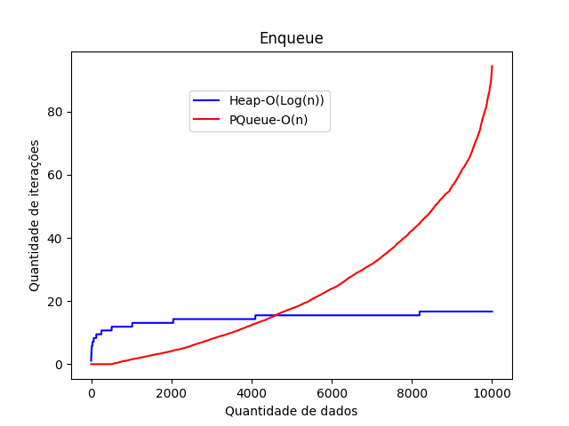
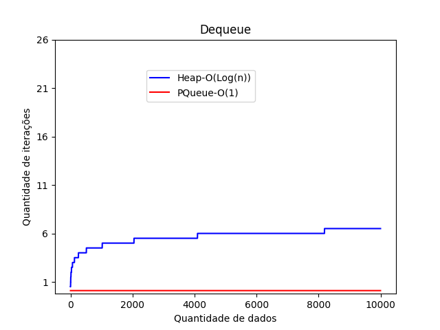

<h2>Resumo</h2>

A contagem de iterações é realizada utilizando uma variavel do tipo double global que adiciona ajustando valores a cada iteração realizada pelas funções das duas estruturas. Após a contagem ser feita os valores são adicionados em arquivos de texto para serem utilizados para a plotagem.

Na plotagem são feitas duas listas para cada estrutura representando os valores de cada iteração das funções de enqueue e dequeue das estruturas, em seguida é realizado o plot utilizando a biblioteca do matplotlib.

No gráfico da função enqueue() é notável um leve erro para a estrutura de fila de prioridade, iniciando com um comportamento de O(n) e em seguida aumenta para O(n^2)

